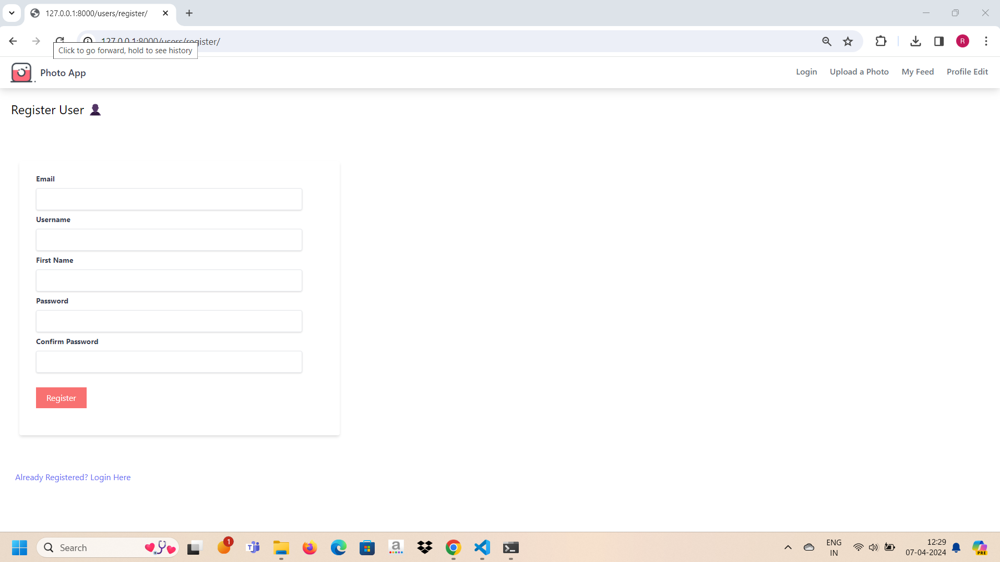
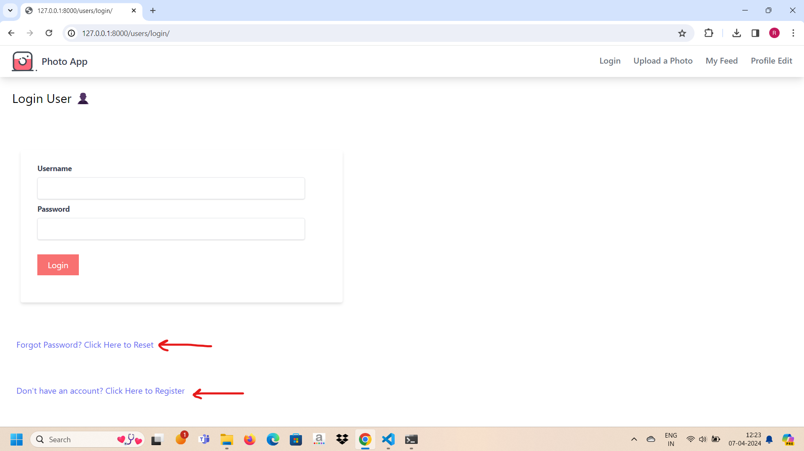
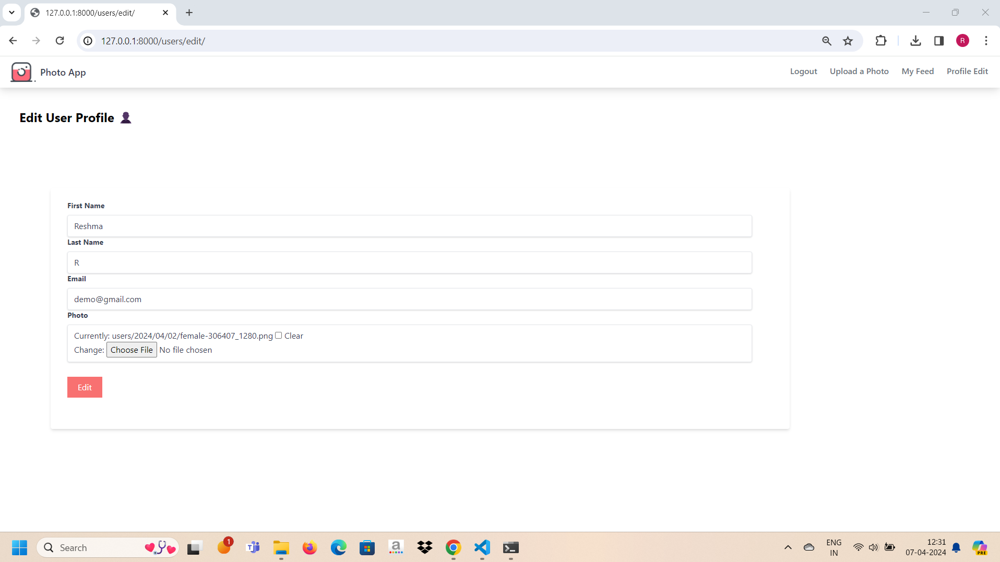
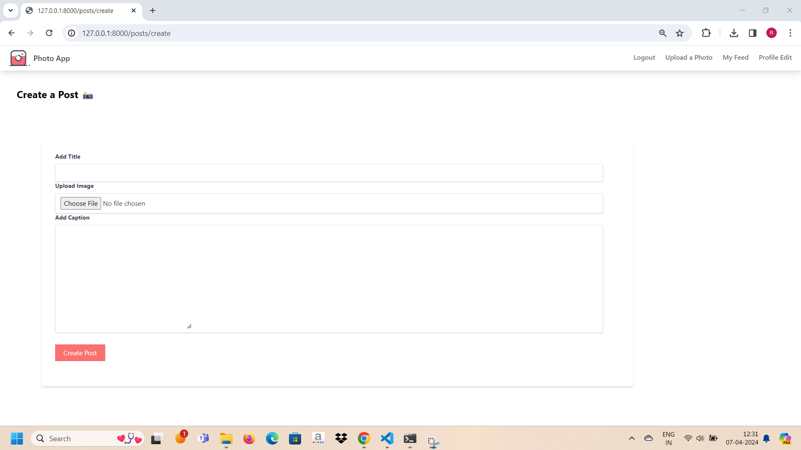

# PhotoApp

A Web based social media app using Django and included a full fledged authentication system with reset and forgot password functionality and sharing photos including liking and commenting functionality.

.png)

.png)

.png)

.png)

